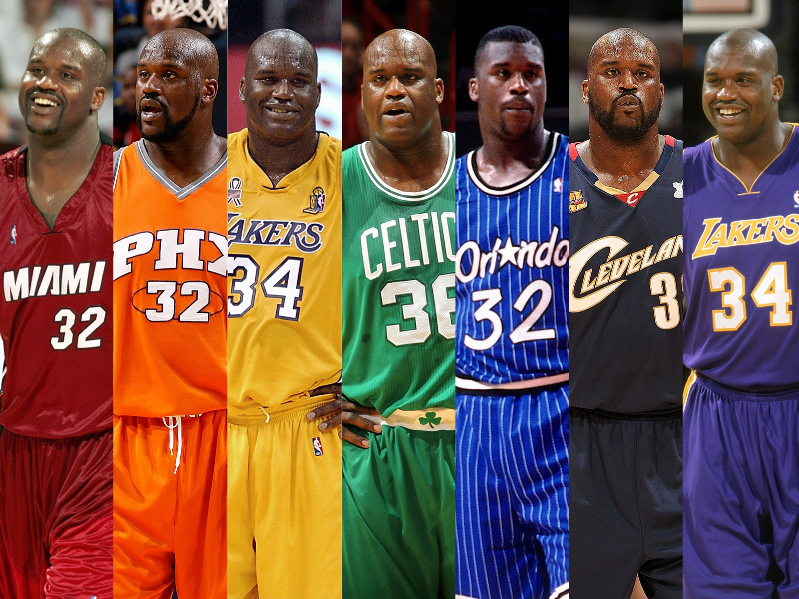

# NBA Teams Mutual Players

I always like to play a game when watching NBA games where I have to remember which players have ever played in both teams that are playing the game. Some teams I can't remember anyone and find it very difficult to find the answer online. So I decided to use python to Find the answer.

In this notebook, I get the list of all players in the NBA that played for each team from Wikipedia, and compare the player list to find the mutual players.

